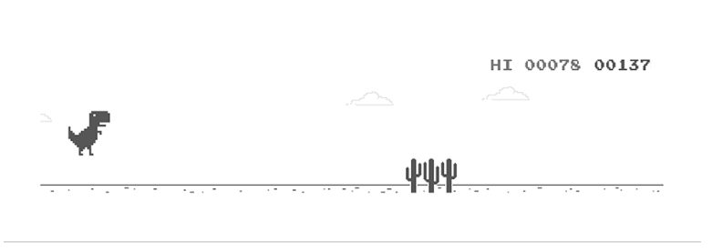

<!-- <h3 align="center"></h3> -->

<!-- <svg fill="none" viewBox="0 0 0 0" width="420" height="420">
  <foreignObject width="100%" height="100%">
    

      
      <h1></h1>
    

  </foreignObject>
</svg> -->

<h1></h1>
<h3 align="center">Hey there, I'm Lis!  </h3>

### 📖 About me

- 💻 I'm a full stack web developer
- 🌱 I’m currently learning everything 🤣
- 🔭 I’m currently open to Work
- 👯 I’m looking to collaborate with other content creators
- 📱 I make apps for Android and iOS
- 🎓 I'm a Civil Constructor sence 2012
- 🌐 You can see some of my projects here
 
 

### Connect with me:

  
  <a href="mailto:lisjardim6@gmail.com">

 
 

### Languages and Tools:

 
 

---

<!--
**Lis-cyber/Lis-cyber** is a ✨ _special_ ✨ repository because its `README.md` (this file) appears on your GitHub profile.

Here are some ideas to get you started:

- 🔭 I’m currently working on ...
- 🌱 I’m currently learning ...
- 👯 I’m looking to collaborate on ...
- 🤔 I’m looking for help with ...
- 💬 Ask me about ...
- 📫 How to reach me: ...
- 😄 Pronouns: ...
- ⚡ Fun fact: ...
  -->
