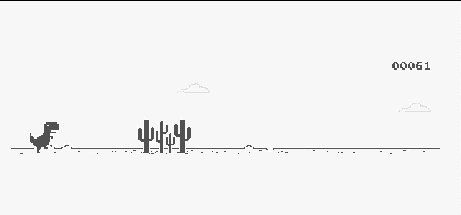

<h1></h1>
<h1 align="center">Hey there, I'm Lis! </h1>

### 📖 About me

- 💻 I'm a full stack web developer
- 🌱 I’m currently learning everything 🤣
- 🔭 I’m currently open to Work
- 👯 I’m looking to collaborate with other content creators
- 📱 I make apps for Android and iOS
- 🎓 I'm a Civil Constructor since 2012
- 🌐 You can see some of my projects here

 
 

### 🛠️ Languages and Tools:

 
 
 

### 📫 Connect with me:

  <a href="https://www.linkedin.com/in/lisbeth-jardim-fullstack-developer/">
  <a href="mailto:lisjardim6@gmail.com">

---

<!--
**Lis-cyber/Lis-cyber** is a ✨ _special_ ✨ repository because its `README.md` (this file) appears on your GitHub profile.

Here are some ideas to get you started:

- 🔭 I’m currently working on ...
- 🌱 I’m currently learning ...
- 👯 I’m looking to collaborate on ...
- 🤔 I’m looking for help with ...
- 💬 Ask me about ...
- 📫 How to reach me: ...
- 😄 Pronouns: ...
- ⚡ Fun fact: ...
  -->
